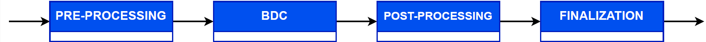

# System Architecture
***

## Modular overview of the CardioHPC IoMT system.

## The main CardioHPC IoMT processing workflow.

# HPC

## HPC deployment.

## CardioHPC simulation experiment architecture.

# Serverless

## CardioHPC simulation experiment architecture.

